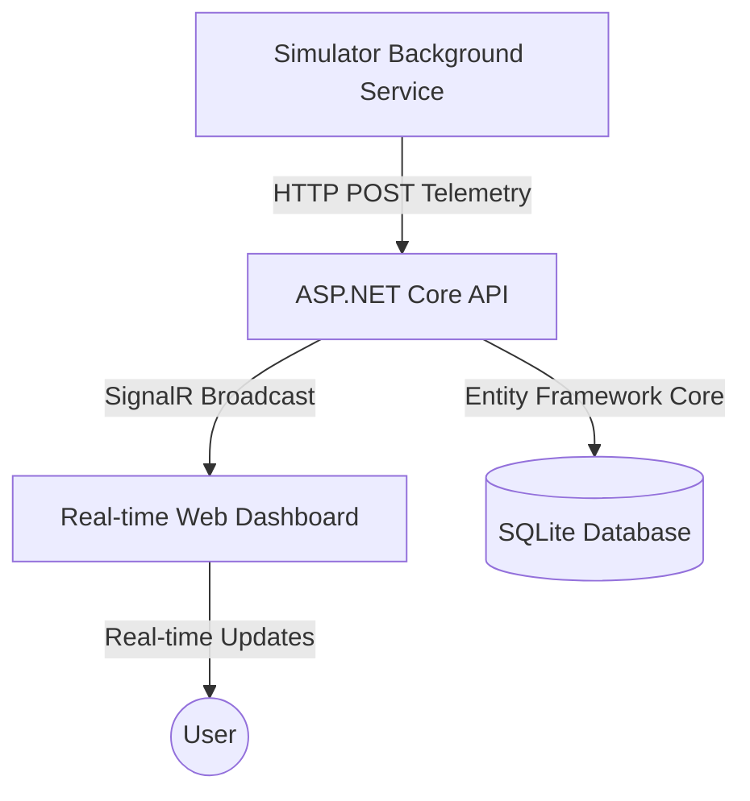

# Sentinel Monitoring: Industrial Sensor Monitoring System

Sentinel Monitoring is a real-time industrial telemetry system built with .NET 8. It demonstrates a complete end-to-end solution for monitoring sensor data, featuring real-time communication, background simulation, and persistent storage.

## 🏗️ Architecture



### Components:
- **SentinelMonitoring.Api**: The core service managing data reception, real-time broadcasts via SignalR, and hosting the dashboard.
- **SentinelMonitoring.Simulator**: A background worker service that simulates an industrial IoT device, generating and sending telemetry data.
- **SentinelMonitoring.Infrastructure**: The data access layer utilizing Entity Framework Core for SQLite persistence.
- **SentinelMonitoring.Core**: Shared domain models and core logic.

## 🚀 Key Features

- **Real-time Telemetry**: Instant data updates on the dashboard using SignalR Hubs.
- **Autonomous Simulation**: Realistic sensor data (Temperature, Pressure, Humidity) generated by a background worker.
- **Persistent History**: Every data point is saved to a SQLite database for historical analysis.
- **Modern Dashboard**: A responsive, dark-mode web interface with live charting using Chart.js.
- **Clean Architecture**: Decoupled projects following industry best practices.

## 🛠️ Tech Stack

- **Backend**: C#, .NET 8, ASP.NET Core Web API
- **Real-time**: SignalR
- **Database**: Entity Framework Core, SQLite
- **Frontend**: HTML5, Vanilla JavaScript, CSS3 (Glassmorphism), Chart.js
- **Tooling**: .NET CLI, Git

## 🏁 Getting Started

### Prerequisites
- [.NET 8 SDK](https://dotnet.microsoft.com/download/dotnet/8.0)

### Running the Project

1. **Clone the repository**:
   ```bash
   git clone https://github.com/ThebeLedwaba/Sentinel-Monitoring.git
   cd Sentinel-Monitoring
   ```

2. **Run the API**:
   ```bash
   dotnet run --project SentinelMonitoring.Api/SentinelMonitoring.Api.csproj --urls http://localhost:5000
   ```

3. **Run the Simulator (in a new terminal)**:
   ```bash
   dotnet run --project SentinelMonitoring.Simulator/SentinelMonitoring.Simulator.csproj
   ```

4. **View the Dashboard**:
   Open your browser and navigate to `http://localhost:5000`.

## 📂 Project Structure

- `SentinelMonitoring.Api/` - Web API, SignalR Hubs, and Dashboard (`wwwroot`)
- `SentinelMonitoring.Simulator/` - IoT Device Simulator (Worker Service)
- `SentinelMonitoring.Infrastructure/` - EF Core DbContext and Data Migrations
- `SentinelMonitoring.Core/` - Shared Models (`SensorData`, `Device`)

---
Developed as a showcase for high-performance C# system engineering.
